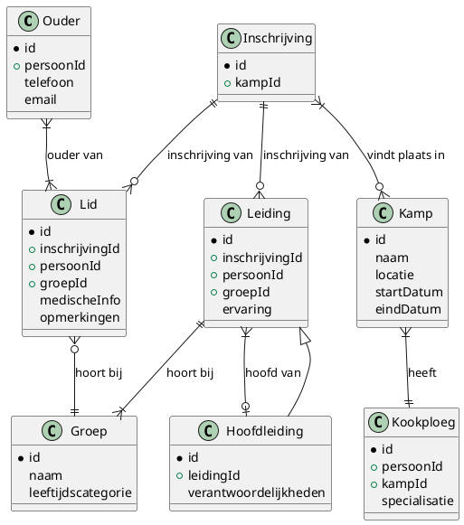

# ERD schema

Voor ons erd schema hebben we **kroki plantuml** gebruikt dat we ingeven via postman.

> API: <https://kroki.io/plantuml/svg>

De volgende code genereert het diagram.

```plantuml
@startuml
class Ouder {
    *id
    +persoonId
    telefoon
    email
}

class Inschrijving {
    *id
    +kampId
}

class Lid {
    *id
    +inschrijvingId
    +persoonId
    +groepId
    medischeInfo
    opmerkingen
}

class Leiding {
    *id
    +inschrijvingId
    +persoonId
    +groepId
    ervaring
}

class Hoofdleiding {
    *id
    +leidingId
    verantwoordelijkheden
}

class Groep {
    *id
    naam
    leeftijdscategorie
}

class Kamp {
    *id
    naam
    locatie
    startDatum
    eindDatum
}

class Kookploeg {
    *id
    +persoonId
    +kampId
    specialisatie
}

' Relaties (class-diagram syntax)
Ouder }|--|{ Lid : ouder van
Inschrijving ||--o{ Lid : inschrijving van
Inschrijving ||--o{ Leiding : inschrijving van
Inschrijving }|--o{ Kamp : vindt plaats in
Lid }o--|| Groep : hoort bij
Leiding ||--|{ Groep : hoort bij
Leiding }|--o| Hoofdleiding : hoofd van
Kamp }|--|| Kookploeg : heeft

' Overerving
Leiding <|-- Hoofdleiding


@enduml
```
