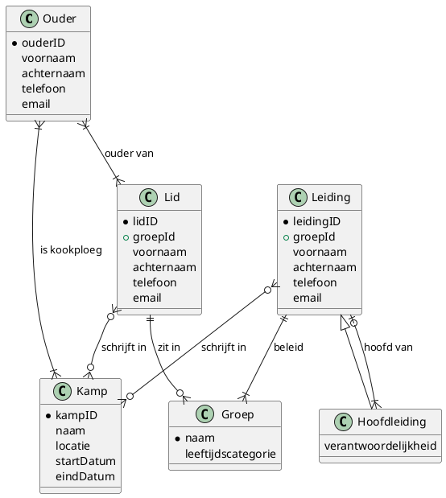

# ERD schema

Voor ons erd schema hebben we **kroki plantUML** gebruikt dat we ingeven via Postman.

> API: <https://kroki.io/plantuml/svg>

De volgende code genereert het diagram.

```plantuml
plantuml
@startuml
class Ouder {
    *ouderID
    voornaam
    achternaam
    telefoon
    email
}

class Lid {
    *lidID
    +groepId
    voornaam
    achternaam
    telefoon
    email
}

class Leiding {
    *leidingID
    +groepId
    voornaam
    achternaam
    telefoon
    email
}

class Hoofdleiding {
    verantwoordelijkheid
}

class Groep {
    *naam
    leeftijdscategorie
}

class Kamp {
    *kampID
    naam
    locatie
    startDatum
    eindDatum
}

' Zero or One      |o--
' Exactly One     ||--
' Zero or Many      }o--
' One or Many       }|--
' Relaties (class-diagram syntax)

Ouder }|--|{ Lid : ouder van
Ouder }|--|{ Kamp : is kookploeg
Lid }o--o{ Kamp : schrijft in
Lid ||--o{ Groep : zit in
Leiding }o--o{ Kamp : schrijft in
Leiding ||--|{ Groep : beleid
Hoofdleiding }|--o| Leiding : hoofd van

' Overerving
Leiding <|-- Hoofdleiding

@enduml
```
